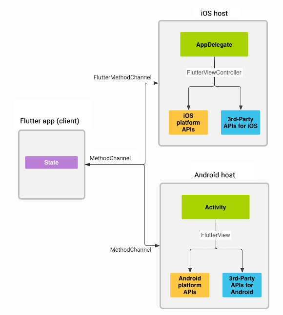

##  Flutter 简介
现在开始玩Flutter的好处呢, 我认为有如下几点:
1. 如果我们以后想在Google的新系统上跑程序的话, 用Flutter来编写是一定没错的.

2. Flutter用Dart, 学习Flutter的同时会使我们掌握一门新的语言. 买一送一.


3. Flutter天生支持iOS风格的控件, 称为Cupertino, 这样我们可以一套设计, 一套code跑在两个系统上.


4. 学习Flutter的过程会改变手机端app开发的思维. 毕竟这个亲只有一个activity. 全程跟个游戏引擎一样. 60帧每秒绘图.

5. Hot reload. 极大地加速了我们的开发效率. 试过了, 绝对会爱上它.

6. Flutter提供method channel给Android和iOS. 其实我们可以只用Flutter来开发UI. 其他底层逻辑可以封装Android和iOS分别的lib package. 然后直接Rx封装写回method channel. 也是一种新的开发模式.性能更好, 兼容性更好, 开发起来更有乐趣.

## 常用Widget
Cupertino和Material是Flutter提供的两种UI风格，前者为iOS风格。

### Navigator&Route

Flutter跳转是通过navigator跳转route。Route是承载全屏视图的widget，类似为iOS中的viewController。APP经常会创建大量的Route，可以通过Route的命名来寻找，通常Route的命名格式为"/a,/b"。
Navigator记录并管理一系列Route的入栈出栈。尽管可以直接创建navigator，但是一般而言，我们常使用MaterialApp、CupertinoApp和widgetsApp自身带有的navigator。常用CupertinoPageRoute和MaterialPageRoute作为页面间跳转的Route。
另外还有PopUpRoutes则是直接弹出，类似iOS中的present方式。我们也可以通过自定义PageRoute来进行一系列订制的内容，比如跳转动画。
另外在app中经常会用到Tabbed navigation（由tab持有的navigator），这同一层级的navigator则由App的RootNavigator来管理。

#### 跳转到系统应用
在iOS里，你使用特点的URL scheme来跳转到其他应用。对于系统级的App，这个scheme依赖于App。为了在Flutter里实现这个功能，创建Native的集成插件，或者使用已有的插件，比如url_launcher。

      Scheme  
      http:<URL> , https:<URL>, e.g. http://flutter.io
      tel:<phone number>, e.g. tel:+1 555 010 999
      sms:<phone number>, e.g. sms:5550101234
      mailto:<email address>?subject=<subject>&body=<body>, e.g. mailto:smith@example.org?subject=News&body=New%20plugin

退出app可以调用下面的方法（iOS不可用）

    //On iOS, calls to this method are ignored because Apple's human interface
    // guidelines state that applications should not exit themselves.
    SystemNavigator.pop();

### CupertinoTabView

可以持有多个同一层级的Navigator，分别管理各自的Route堆栈。类似iOS中的UITabBarController。

### Container
一个常用的widget，它结合了常见的绘画，定位和大小调整,可以把它最终表现看为UIView，其decoration属性则是近似于UIView的layer，可以设置圆角，渐变色，边框等。（warning:color和decoration不能同时设置）
```
 assert(color == null || decoration == null,
         'Cannot provide both a color and a decoration\n'
         'The color argument is just a shorthand for "decoration: new BoxDecoration(color: color)".'
       )
```
container结构如下：


#### 构造方法
``` dart
Container({
  Key key,
  this.alignment,
  this.padding,
  Color color,
  Decoration decoration,
  this.foregroundDecoration,
  double width,
  double height,
  BoxConstraints constraints,
  this.margin,
  this.transform,
  this.child,
})
```

#### 属性介绍
* alignment：控制child的对齐方式，如果container或者container父节点尺寸大于child的尺寸，这个属性设置会起作用，有很多种对齐方式
* padding：decoration内部的空白区域，如果有child的话，child位于padding内部。padding与margin的不同之处在于，padding是包含在content内，而margin则是外部边界，设置点击事件的话，padding区域会响应，而margin区域不会响应
* color：用来设置container背景色，如果foregroundDecoration设置的话，可能会遮盖color效果
* decoration：绘制在child后面的装饰，设置了decoration的话，就不能设置color属性，否则会报错，此时应该在decoration中进行颜色的设置
* foregroundDecoration：绘制在child前面的装饰
* width：container的宽度，设置为double.infinity可以强制在宽度上撑满，不设置，则根据child和父节点两者一起布局
* height：container的高度，设置为double.infinity可以强制在高度上撑满
* constraints：添加到child上额外的约束条件
* margin：围绕在decoration和child之外的空白区域，不属于内容区域
* transform：设置container的变换矩阵，类型为Matrix4
* child：container中的内容widget

### Row，Column
Row，Column是一个将其children显示在水平,或垂直方向的widget

#### 构造方法
``` dart
Row({
Key key,
MainAxisAlignment mainAxisAlignment = MainAxisAlignment.start,
MainAxisSize mainAxisSize = MainAxisSize.max,
CrossAxisAlignment crossAxisAlignment = CrossAxisAlignment.center,
TextDirection textDirection,
VerticalDirection verticalDirection = VerticalDirection.down,
TextBaseline textBaseline,
List<Widget> children = const <Widget>[],
})
```

#### 属性介绍
> mainAxisAlignment 如何将child沿主轴放置在布局中
* start: 将child放置在主轴的最左侧
* center: 将child放置在主轴的中间
* end: 将child放置在主轴的最右侧
* spaceAround: 将自由空间放置在孩子之间，第一个和最后一个child与边界的距离是其他孩子之间的一半
* spaceBetween: 将自由空间放置在孩子之间，第一个和最后一个child与边界之间没有空间
* spaceEvenly: 将自由空间均匀的放置在children之间
> crossAxisAlignment 如何将child沿侧轴放置在布局中
* start: 将child放置在侧轴起点
* center: 将child放置在侧轴的中心
* end: 将child放置在侧轴的末端
* stretch: 将child填充侧轴
* baseline: 将child放置在侧轴上，使他们的基线匹配
> mainAxisSize: 主轴应占用多少空间
* max: 最大化沿主轴的可用空间量，默认值
* min: 最小化沿主轴的可用空间量


### Expanded
在Flex,Row,Column的children中使用Extanded包裹会使child尽可能的充满剩余空间，使用flex可以设置对应的child占用的空间是其他child的倍数,默认flex:1

    Expanded(flex: 1,
             child: Container(
                 child: Text(text, textAlign: TextAlign.right,),
                 padding: EdgeInsets.only(right: 10),
               ),
             )

### Image&Icon
Flutter中用Image来加载显示图片，数据源可以是本地的Asset，data，Url和手机内存。

    Image.asset(name);//工程地址
    Image.network(src);//网络图片地址
    Image.file(file);//手机内存文件
    Image.memory(bytes);//data
Image定义了一系列的参数，可以通过这些参数改变外观，大小，混合。

    const Image({
      ...
      this.width, //图片的宽
      this.height, //图片高度
      this.color, //图片的混合色值
      this.colorBlendMode, //混合模式
      this.fit,//缩放模式
      this.alignment = Alignment.center, //对齐方式
      this.repeat = ImageRepeat.noRepeat, //重复方式
      ...
    })

fit：该属性用于在图片的显示空间和图片本身大小不同时指定图片的适应模式。适应模式是在BoxFit中定义，它是一个枚举类型，有如下值：

    fill：会拉伸填充满显示空间，图片本身长宽比会发生变化，图片会变形。
    cover：会按图片的长宽比放大后居中填满显示空间，图片不会变形，超出显示空间部分会被剪裁。
    contain：这是图片的默认适应规则，图片会在保证图片本身长宽比不变的情况下缩放以适应当前显示空间，图片不会变形。
    fitWidth：图片的宽度会缩放到显示空间的宽度，高度会按比例缩放，然后居中显示，图片不会变形，超出显示空间部分会被剪裁。
    fitHeight：图片的高度会缩放到显示空间的高度，宽度会按比例缩放，然后居中显示，图片不会变形，超出显示空间部分会被剪裁。
    none：图片没有适应策略，会在显示空间内显示图片，如果图片比显示空间大，则显示空间只会显示图片中间部分。

### GestureDetector
使用GestureDetector，可以监听多种手势

单击
* onTapDown - 指针在特定的位置接触屏幕时
* onTapUp - 指针从屏幕特定位置离开时
* onTap - 点击事件发生时
* onTapCancel - 指针触发了onTapDown但是没有触发onTap

双击
* onDoubleTap - 用户快速点击屏幕相同位置两次

长按

* onLongPress - 指针在屏幕上相同位置保持一段较长时间

垂直拖拽
* onVerticalDragStart - 指针开始接触屏幕，并将要垂直方向上滑动
* onVerticalDragUpdate - 指针在垂直方向上离开屏幕后
* onVerticalDragEnd -指针先在屏幕上垂直方向滑动，然后以特定的速度离开屏幕

水平拖拽
* onHorizontalDragStart - 指针开始接触屏幕，并将要横向滑动
* onHorizontalDragUpdate - 指针在横向上离开屏幕后
* onHorizontalDragEnd - 指针先在屏幕上横向滑动，然后以特定的速度离开屏幕

### ListView

  ListView是非常常用的滚动Widget。用来在不同的滚动方向上展示子控件。itemExtent（double类型）会强制子控件（cell）为制定尺寸。明确的itemExtent比子控件自适应尺寸在展示上更有效率。

  ListView有四种构造方式：
  1. ListView():
  默认的构造方式,适合少量子控件（cell）的列表，会构建所有可能展示的子控件。

          ListView(
            children: <Widget>[  
            ],
          )

  2. ListView.builder():
  带有一个IndexedWidgetBuilder,适用于有大量子控件（cell）的列表，只会构建实际可见的子控件。

          ListView.builder(
            itemCount: 10,
            itemBuilder: (context,i){
              return  Container(
                color: Colors.red,
                width: 200,
                height: 50,
                );
            },
          )


  3. ListView.separated():
  带两个IndexedWidgetBuilder,适合固定数量的子控件（cell）列表，会在各个子控件中间构建separator控件。
          ListView.separated(
            itemCount: 10,
            itemBuilder: (context,i){
              return  Container(
                color: Colors.red,
                width: 200,
                height: 50,
              );
            },
            separatorBuilder: (context,i){
              return Container(
                color: Colors.blue,
                height: 20,
                width: 100,
              );
            },
          )    

丑图示例：


4. ListView.custom():
通过SliverChildDelegate，可以任意自定义子控件。
        ListView.custom(
         childrenDelegate: SliverChildBuilderDelegate(
           (context, index) {
             return Container();
           },
           childCount: 10,
         ),

ListView中的子控件（cell）点击事件是在子空间外包用GestureDetector一层，通过其onTap方法即可实现。

### GridView
### **简介**
> GridView在移动端上非常的常见的滚动列表,  会占满给出的空间区域.


### **基本用法**

>属性介绍

- scrollDirection：滚动的方向，有垂直和水平两种，默认为垂直方向（Axis.vertical）。

- reverse：默认是从上或者左向下或者右滚动的，这个属性控制是否反向，默认值为false，不反向滚动。

- controller：控制child滚动时候的位置。

- primary：是否是与父节点的PrimaryScrollController所关联的主滚动视图。

- physics：滚动的视图如何响应用户的输入。

- shrinkWrap：滚动方向的滚动视图内容是否应该由正在查看的内容所决定。

- padding：四周的空白区域。

- gridDelegate：控制GridView中子节点布局的delegate。

- cacheExtent：缓存区域。

### **进阶用法**

> GridView 提供其他四种构造方法

- GridView.builder
- GridView.custom
- GridView.count
- GridView.extent

> GridView.count
指定长度创建子组件,常用方法
```
GridView.count(
        crossAxisCount: 2,
        crossAxisSpacing: 20,
        childAspectRatio: 2,
        mainAxisSpacing: 10,
        padding: const EdgeInsets.all(16.0),
        children: <Widget>[

        ],
      )
```

> `GridView.extent`
指定长度创建子组件
- maxCrossAxisExtent: 设置副轴最大单项宽度，如外层容器宽度100, maxCrossAxisExtent为50，单行显示2个widget，如果外层容器变成150,则单行显示3个widget.如果超过容器宽度，或者单行没法满足两个，则按照一行填充1个widget。下面代码可以通过修改scrollDirection方向来看到不同效果。
  ```
  GridView.extent(
    scrollDirection: Axis.vertical,
    maxCrossAxisExtent: 150,
    mainAxisSpacing: 10,
    crossAxisSpacing: 10,
    childAspectRatio: 1,
    children: List.generate(
      10,
      (index) {
        return Container(

        );
      },
    ),
  ),
  ```

> `GridView.custom`
动态创建子组件
- SliverGridDelegate gridDelegate : 布局相关
- SliverChildDelegate childrenDelegate：动态创建子组件
	```
    //单行最大数量布局
		gridDelegate: SliverGridDelegateWithFixedCrossAxisCount(
			crossAxisCount: 10, // 单行最大10个元素布局
		),
		//单列最大宽度
    布局
		gridDelegate: SliverGridDelegateWithMaxCrossAxisExtent(
			maxCrossAxisExtent: 100, // 单列最大宽度100
		),

    // 创建无限滚动
		childrenDelegate: SliverChildBuilderDelegate(	// 创建无限滚动
			(context, index) {
				return Container(
					child: Text('$index'),
				);
			},
			semanticIndexCallback: (widget, index) {	// 滚动时回调函数
				print('index $index');
			},
		),

    // 创建有数量的滚动
		childrenDelegate: SliverChildListDelegate(
			List.generate(30, (index) {
				return Container(
					child: Text('index $index'),
				);
			}),
		),
	```

> `GridView.builder`
按需创建组件，跟custom差不多，但增加itemCount来限制加载子组件最大值，itemCount取代childrenDelegate来动态创建组件。
- itemCount： 子组件最大数量，默认没有限制。效果跟GridView.custom一致
- gridDelegate：设置布局，单行最大布局数量或单列单项最大长度，参考GridView.custom
- itemBuilder：子组件动态加载回调方法，长度受itemCount值影响，itemCount不为0且存在时，数量需小于itemCount值
	```
	GridView.builder(
			itemCount: 31,
			gridDelegate: SliverGridDelegateWithFixedCrossAxisCount(
				crossAxisCount: 3, // 单行最大数量值
			),
			itemBuilder: (context, index) {
				print('index $index');
				return Center(
					child: Text('index $index'),
				);
			},
		),
	```

### 流式布局
#### wrap 流式布局控件（A widget that displays its children in multiple horizontal or vertical runs.）
自动换行控件，简单的流式布局展示方式类似于使用默认UICollectionViewFlowLayout的CollectionView。

    Wrap(
      spacing: 8.0, // gap between adjacent chips
      runSpacing: 4.0, // gap between lines
      children: <Widget>[
        Chip(
          avatar: CircleAvatar(backgroundColor: Colors.blue.shade900, child: Text('AH')),
          label: Text('Hamilton'),
        ),
        Chip(
          avatar: CircleAvatar(backgroundColor: Colors.blue.shade900, child: Text('ML')),
          label: Text('Lafayette'),
        ),
        Chip(
          avatar: CircleAvatar(backgroundColor: Colors.blue.shade900, child: Text('HM')),
          label: Text('Mulligan'),
        ),
        Chip(
          avatar: CircleAvatar(backgroundColor: Colors.blue.shade900, child: Text('JL')),
          label: Text('Laurens'),
        ),
      ],
    )

####  Flow(类似collectionView自定义layout情况)
我们一般很少会使用Flow，因为其过于复杂，需要自己实现子widget的位置转换，在很多场景下首先要考虑的是Wrap是否满足需求。Flow主要用于一些需要自定义布局策略或性能要求较高(如动画中)的场景。Flow有如下优点：

性能好；Flow是一个对child尺寸以及位置调整非常高效的控件，Flow用转换矩阵（transformation matrices）在对child进行位置调整的时候进行了优化：在Flow定位过后，如果child的尺寸或者位置发生了变化，在FlowDelegate中的paintChildren()方法中调用context.paintChild 进行重绘，而context.paintChild在重绘时使用了转换矩阵（transformation matrices），并没有实际调整Widget位置。
灵活；由于我们需要自己实现FlowDelegate的paintChildren()方法，所以我们需要自己计算每一个widget的位置，因此，可以自定义布局策略。
缺点：

使用复杂.
不能自适应子widget大小，必须通过指定父容器大小或实现TestFlowDelegate的getSize返回固定大小。

### Layout
flutter中，widgets的渲染是依据RenderBox objects。Render boxes提供其patent的约束和自己的约束尺寸。通常有三种情况。

* 尽可能的大. 如 Center and ListView.
* 和子控件大小一致. 如Transform and Opacity.
* 尽量匹配尺寸. 如image和text，尽量和其内容大小适应。

#### Unbounded constraints
无限大小，即设置控件的maximum width 或 maximum height 为double.INFINITY。例如 Flex(Row,Column) scrollable regions(ListView,GridView 或者其他scrollView的子类)。

ListView会尽可能的伸展其宽度为parent大小，假如嵌套一个竖直方向的`listview_v`在一个水平方向的`listview_h`内，则`listview_v`会尽可能伸展其宽度，达到和`listview_h`的滑动方向尺寸一样大。

#### Flex
Flex类（Row,Column）控件在有边界的约束和无边界约束会有不同的表现。在有边界约束内会尽可能的大，在无边界的约束中，它会尽可能的和子控件大小一致。同时在无边界的约束中，不能用Expanded控件来拓宽其大小,另外，在Cross direction，其大小必须是有边界的，如Column的宽，Row的高，否则将不能合理的对其子控件。

#### container
`Containers with no children try to be as big as possible ` unless the incoming constraints are unbounded, in which case they try to be as small as possible. `Containers with children size themselves to their children`. The width, height, and constraints arguments to the constructor override this.

container的layout有些复杂，像女人的心思难以琢磨，其大小因子控件或者设置的不同而表现出不同情况。

##### Layout behavior

Since Container combines a number of other widgets each with their own layout behavior, Container's layout behavior is somewhat `complicated`.

Summary: Container tries, in order: to honor alignment, to size itself to the child, to honor the width, height, and constraints, to expand to fit the parent, to be as small as possible.

More specifically:

If the widget has no child, no height, no width, no constraints, and the parent provides unbounded constraints, then Container tries to size as small as possible.

If the widget has no child and no alignment, but a height, width, or constraints are provided, then the Container tries to be as small as possible given the combination of those constraints and the parent's constraints.

If the widget has no child, no height, no width, no constraints, and no alignment, but the parent provides bounded constraints, then Container expands to fit the constraints provided by the parent.

If the widget has an alignment, and the parent provides unbounded constraints, then the Container tries to size itself around the child.

If the widget has an alignment, and the parent provides bounded constraints, then the Container tries to expand to fit the parent, and then positions the child within itself as per the alignment.

Otherwise, the widget has a child but no height, no width, no constraints, and no alignment, and the Container passes the constraints from the parent to the child and sizes itself to match the child.


### 编写自定义平台指定代码

Flutter使用灵活的系统，允许您调用特定于平台的API，无论是在Android上的Java或Kotlin代码中，还是在iOS上的Objective-C或Swift代码中。
Flutter的特定于平台的API支持不依赖于代码生成，而是依赖于灵活的消息传递样式：

1. 应用的Flutter部分通过平台频道向其主机（应用的iOS或Android部分）发送消息。

2. 在主机监听的平台通道，并接收该消息。然后，它使用本机编程语言调用任意数量的特定于平台的API，并将响应发送回客户端，即应用程序的Flutter部分。





消息和响应以异步方式传递，以确保用户界面保持响应。

在客户端，MethodChannel（API）允许发送与方法调用相对应的消息。在平台方面，MethodChannel 在Android（API）和FlutterMethodChanneliOS（API）上启用接收方法调用并发回结果。

参考网页：https://flutter.dev/docs/development/platform-integration/platform-channels

### Flutter于Native
0. Flutter方案
https://github.com/flutter/flutter/wiki/Add-Flutter-to-existing-apps#write-code-to-use-flutterviewcontroller-from-your-host-app
1. 阿里方案 FlutterBoost
 https://github.com/alibaba/flutter_boost/blob/master/README_CN.md
 https://mp.weixin.qq.com/s/VlleaiIzsZHZDkDrGgYi1g
2. 腾讯Now视频直播方案
https://juejin.im/post/5b6cea3c6fb9a04fca3ca608
2. 今日头发方案


### keynotes
0. Column和row内嵌套listview 需在listview外包裹一层Expanded,Column放到ListView内需衣服内部Expanded控件。
### Flutter 使用过程中的confused
0. flutter 控件太多，学习曲线拉伸的极长。
1. flutter布局和swift布局逻辑不太一样，其控件的默认大小是刚好满足内容所需要的且无法直接对其设置大小，例如Text的大小仅仅是其文本的内容大小，若想要其在某个size内居中则需要在外面再嵌套一层，实现起来不太方便。
2. 从一个tab的某个页面直接跳转到另一个tab的首页似乎没有很直接的办法，不是很方便。
3. flutter图片使用不够方便，需要在.yaml文件中先添加路径。
4. flutter在控件使用上不够自由，没有丰富的API来订制一些特殊需求，比如navigation bar的一些设置。
5. flutter 没有类似UITableview中section 的概念，所以有多个section的list没有现成控件可以直接使用。
6. 类型推断在书写代码时没问题，但在编译过程中可能会因类型为dynamic不匹配crash，需显性的确定类型。
